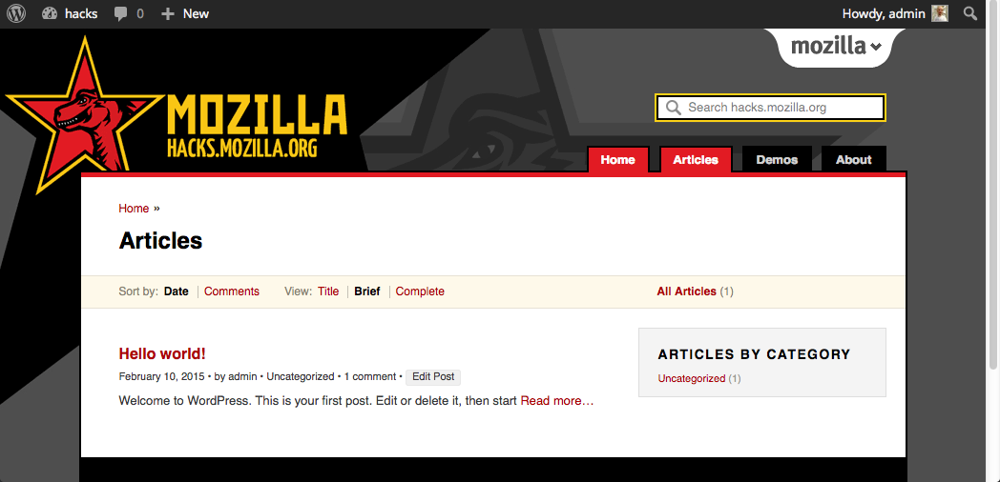

**Note:** *This theme was active on [hacks.mozilla.org](https://hacks.mozilla.org/) from 2013 to 2015. The next theme is at https://github.com/potch/hax.*

# Mozilla Hacks

Mozilla Hacks is one of Mozilla’s most important channels for developer outreach and engagement. We want it to be one of the key resources for people developing for the Open Web, talking about both news and in-depth descriptions of technologies and features. We will cover both development tips and tricks in general, but also look at features in Mozilla’s products from a technical perspective – to show our approach and line of thinking, and hopefully inspire other companies to implement what we have.

Mozilla Hacks is, just like [MDN (Mozilla Developer Network)](https://developer.mozilla.org/), a web browser agnostic resource, focused on the Open Web and sharing knowledge with all web developers out there.

More in-depth information can be found in the [wiki page for Mozilla Hacks](https://wiki.mozilla.org/Engagement/Developer_Engagement/Hacks_blog).

[hacks.mozilla.org](https://hacks.mozilla.org/)

## Local setup for development

1. Clone the repo:

    `git clone https://github.com/mozilla/mozhacks.git`

2. Link the theme into your wordpress `themes` folder:

    `ln -s /absolute/path/to/clone/of/mozhacks/themes/Hacks2013
    /path/to/wordpress/themes/Hacks2013`

3. Link the scripts into your `wp-content` folder:

    `ln -s /absolute/path/to/clone/of/mozhacks/scripts
    /path/to/wp-content/scripts`

4. Go to your local Themes Manager and activate the Mozilla Hacks, 2013 theme.

Your wordpress site should now display the Hacks theme! Make changes in your
clone repository to see them on your local site.

